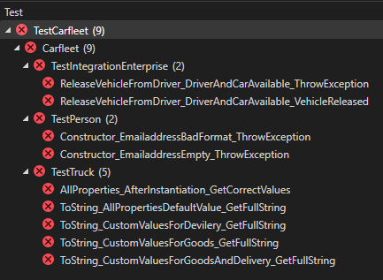
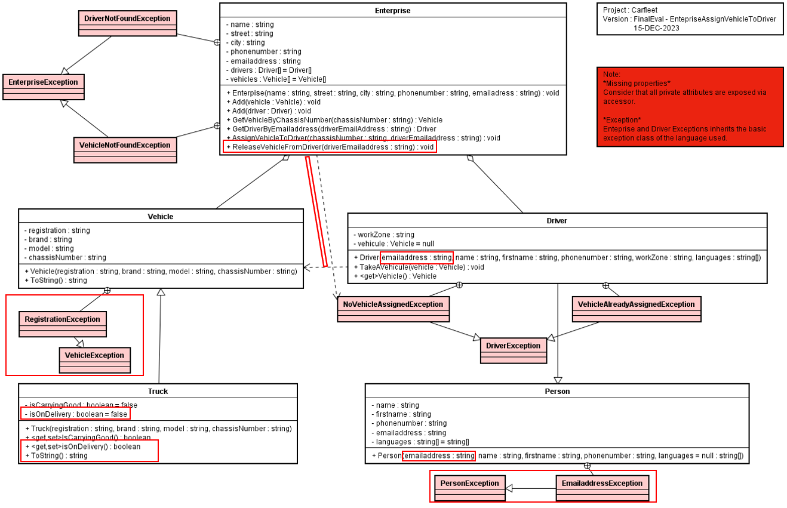
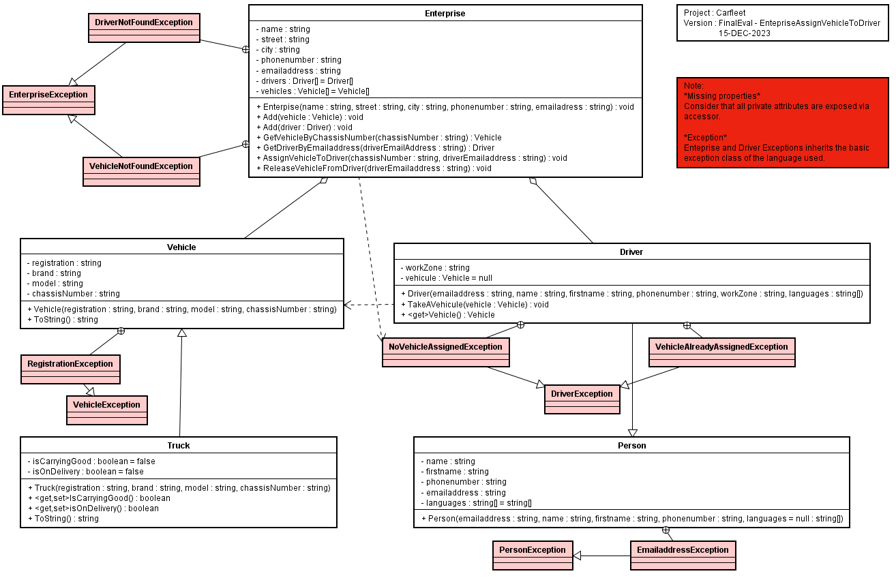

# 226b - Carfleet - Eval

## Sujet à traiter
Application de gestion d'une flotte de véhicule.

### Prise en main du code

1)  Récupérer le dépôt

```
    git clone <url du dépôt>
```
   
2) Réaliser la première compilation. Il est important que le réseau soit disponible. Le gestionnaire de dépendences (Nguet) en a besoin pour fonctionner correctement.

```
1>Done building project "Carfleet.csproj".
2>------ Build started: Project: Console, Configuration: Debug Any CPU ------
3>------ Build started: Project: TestCarfleet, Configuration: Debug Any CPU ------
2>Console -> <yourLocalPath>\CarfleetExamBase_Trainee\Console\bin\Debug\net6.0\Console.dll
3>TestCarfleet -> C:\Users\nicolas.glassey\MyDevs\CPNV\CFC\226\226b\CarfleetExamBase_Trainee\TestCarfleet\bin\Debug\net6.0\TestCarfleet.dll
========== Build: 3 succeeded, 0 failed, 0 up-to-date, 0 skipped ==========
========== Build completed at 09:15 and took 00.756 seconds ==========
```

3) Lancer ensuite tous les tests du projet.



4) Etudier le diagramme de classe

Note : en rouge les mises à jour.



Le diagramme est également disponible ici, sans les annotations en rouge:



### Moyens à disposition

* Un environnement de développement Visual Studio 2022 Entreprise.
* Tout le code produit durant le cours.
* Le réseau est exclu (excepté pour la première compilation) tout comme le travail collaboratif.
* 45 minutes.

### Livrables attendus
* Une archive compressée contenant **uniquement** les trois classes métiers (Article.cs, CartItem.cs et Cart.cs).

* Le nommage de l'archive : <nomDeFamille_TDD>.zip.

* Les modalités de livraison spécifiques sont à définir avec votre animateur/trice.

### Evaluation

*Généralités*
* Vous devez réussir à passer les tests qui sont actuellement en erreur.
* Ne pas déstabiliser les tests actuels.
* Les valeurs retournées par les classes métiers doivent être calculées (par retour codé en dure)

*Qualité du livrabe*
* Respect des consignes de livraison.
* Respect des principes POO.
* Les classes de tests ne doivent avoir subi aucune modification.

**Notation**

    Note = (nbPointsObtenus/nbPointsMax)/5+1

**Auteur**

Nicolas Glassey

15-DEC-2023